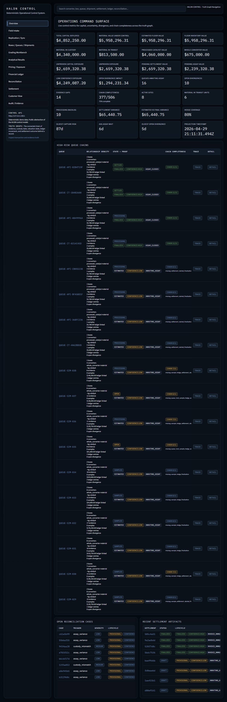
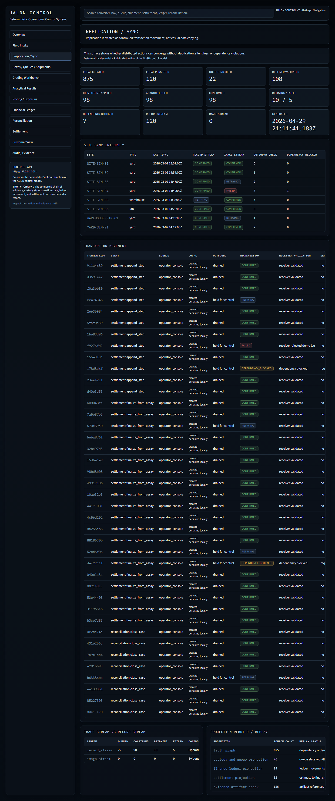
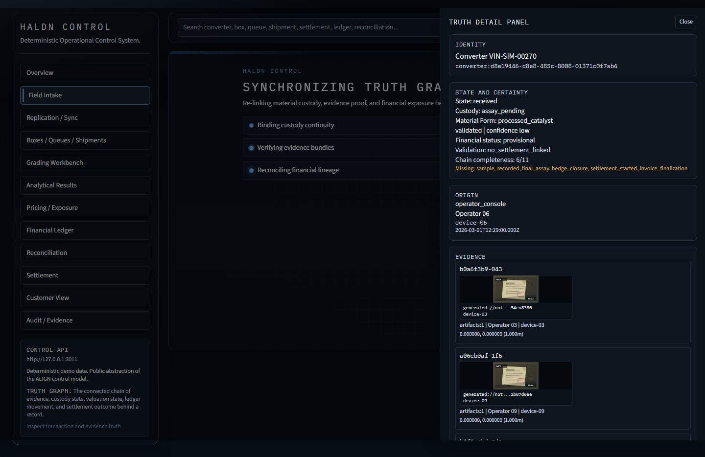

# Deterministic Control System

**Clean-room ALIGN architecture reference**

A public implementation showing how a control platform can keep physical work, recorded state, delayed laboratory measurement, changing market values, and final payment aligned.

This repository uses deterministic synthetic data. It demonstrates architecture, control behavior, operator workflows, and implementation depth without publishing proprietary source code, customer data, trade parameters, or private infrastructure.

[Mike Holton's portfolio](https://haldn.com/mike) | [GitHub profile](https://github.com/mholton-ops) | [Public-safe boundary](docs/public-safe-boundary.md)

## The Operating Problem in Plain English

The source operating environment was a specialized materials business that purchased high-value physical goods before laboratory processing established their final recoverable value.

Those goods changed hands and physical form while market prices could continue to move. A trustworthy system therefore had to answer, at any time:

- Who owns each batch?
- What physical work has occurred?
- What evidence supports the recorded state?
- What is the expected value while measurement is still incomplete?
- Where can changing market prices affect margin?
- Does final payment match the complete operating history?

That is why this system is designed as an integrity and control platform, not a conventional create-read-update-delete application.

## What This Repository Proves

| Control concern | Public implementation |
| --- | --- |
| Recorded truth | Append-only transaction envelopes, additive correction, provenance, and reconstruction |
| Distributed operation | Dependency-aware application, idempotent replay, sync monitoring, and deterministic recovery |
| Physical and financial alignment | Custody, laboratory results, valuation, market-price risk, ledger state, and final payment remain connected |
| Divergence handling | Explicit detection rules create owned reconciliation work instead of silently accepting drift |
| Evidence | Critical state carries source, actor, time, and supporting-evidence requirements |
| Operator control | A workbench exposes queues, exceptions, trace history, reconciliation, and controlled customer visibility |
| Verification | Deterministic seeds, simulations, integration tests, state audits, and guarantee checks |

## Screenshots

### Overview Command Surface

### Replication and Sync

### Truth Detail

## Architecture at a Glance

~~~mermaid
flowchart LR
  Field[Field and Mobile Capture] --> Commands[Command API]
  Equipment[Stations and Equipment] --> Commands
  Commands --> Log[(Append-Only Transaction Log)]
  Log --> Apply[Deterministic Application]
  Apply --> State[(Operational Projections)]
  State --> Workbench[Operator Workbench]
  Log --> Trace[Trace and Reconstruction]
  State --> Detect[Divergence Detection]
  Detect --> Reconcile[Operator Reconciliation]
  Reconcile --> Commands
~~~

The architecture separates accepted history from derived current state. Operators can inspect the evidence, replay history, detect disagreement, and write controlled resolutions without rewriting the original record.

## Review in 10 Minutes

1. Read [Architecture](docs/architecture.md) for the transaction, projection, and replication model.
2. Read [System Guarantees](docs/system-guarantees.md) for the invariants the implementation must preserve.
3. Review [Architecture Diagrams](docs/diagrams.md) for system topology and lifecycle views.
4. Inspect [the command processor](packages/replication/src/command-processor.ts) for deterministic application and dependency handling.
5. Inspect [workbench projections](packages/projections/src/workbench.ts) and [customer visibility](packages/projections/src/customer-visibility.ts).
6. Use the [Reviewer Runbook](docs/reviewer-runbook.md) to generate deterministic fixtures and screenshots.

## Core Guarantees

- Accepted history is immutable and corrections are additive.
- Every critical state change has an explicit origin.
- Replaying the same accepted history produces the same state.
- Offline and delayed work can be applied safely and idempotently.
- Evidence, custody, measurement, valuation, and final payment remain traceable.
- Disagreement becomes visible reconciliation work.
- No critical record is allowed to become an unexplained orphan.
- Controls are enforced by the system rather than relying on operator memory.

See [System Guarantees](docs/system-guarantees.md) and [Reconciliation](docs/reconciliation.md).

## Current Public Implementation

The repository includes:

- TypeScript monorepo with typed domain invariants and state machines
- Zod command, event, and query contracts
- PostgreSQL and Drizzle schemas for provenance, evidence, custody, measurement, pricing, finance, final payment, and reconciliation
- Fastify command and query API with deterministic command processing
- Checkpoint-based projection worker and materialized operator views
- Dependency-aware replication, replay, and convergence monitoring
- Next.js operator workbench with trace, exception, and reconstruction surfaces
- Read-only customer visibility that exposes approved status and proof without granting internal control authority
- Deterministic seed and simulation scenarios
- Integration, API, state-transition, and guarantee-verification tests

This is an inspectable reference implementation, not a claim of production deployment or a copy of a private system.

## Run Locally

Prerequisites:

- Docker Desktop
- Node.js 20+

~~~bash
docker compose -f docker/compose.yml up -d postgres
npm run db:migrate
npm run db:seed
npm run simulate
npm run projections:worker:once
npm run dev:api
npm run dev:web
~~~

Then open the operator workbench and follow the [Reviewer Runbook](docs/reviewer-runbook.md).

## Verification

~~~bash
npm run test:integration
npm run test:api-integration
npm run test:state-audit
npm run verify:guarantees
npm run build
~~~

The GitHub Actions CI gate performs database bootstrapping, projection materialization, type checking, integration tests, state auditing, guarantee verification, and workspace builds.

A separate manual workflow generates deterministic reviewer fixtures and screenshots.

## Repository Map

~~~text
apps/
  api/                 Fastify control-plane API
  operator-web/        Next.js operator workbench
packages/
  domain/              Invariants and state machines
  contracts/           Typed command, event, and query contracts
  db/                  PostgreSQL schema, migrations, and seeds
  event-log/           Append-only transaction envelopes
  replication/         Dependency-aware deterministic application
  projections/         Operator and customer read models
  simulation/          Deterministic scenario runner
docs/
  architecture.md
  diagrams.md
  domain-model.md
  system-guarantees.md
  reconciliation.md
  reviewer-runbook.md
  public-safe-boundary.md
~~~

## Design Choices

- **Append-only history plus derived projections** provides replayability and auditability while keeping operational reads fast.
- **Explicit rules for divergence** make exceptions explainable to operators and reviewers.
- **Operator-focused interfaces** prioritize investigation, traceability, and controlled action over decorative dashboards.
- **Deterministic synthetic scenarios** make the architecture inspectable without exposing protected business data.
- **Public-safe boundaries** preserve architectural proof while intentionally omitting private integrations, formulas, counterparties, and customer information.

## Public-Safe Boundary

This project is original, clean-room, and public-safe. It preserves the architecture, guarantees, and engineering discipline of high-consequence operational control while abstracting confidential workflows and commercial specifics.

See [Public-Safe Boundary](docs/public-safe-boundary.md) for the exact scope.
