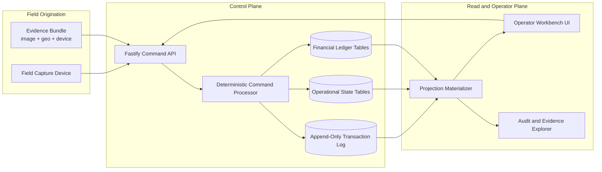
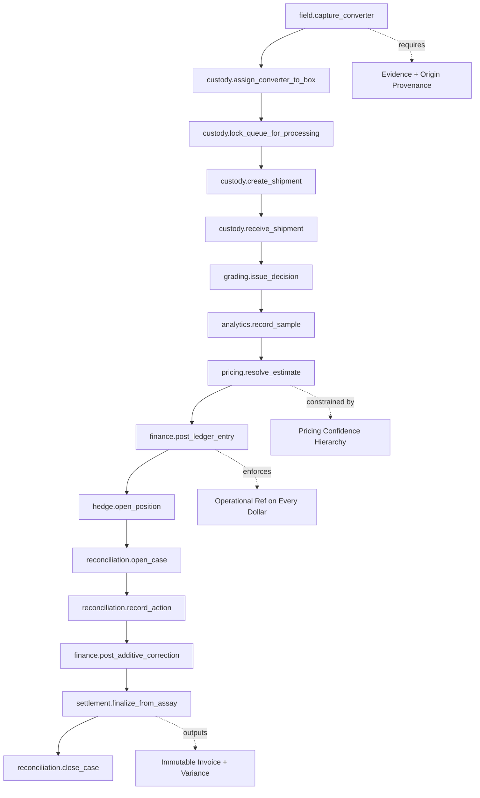
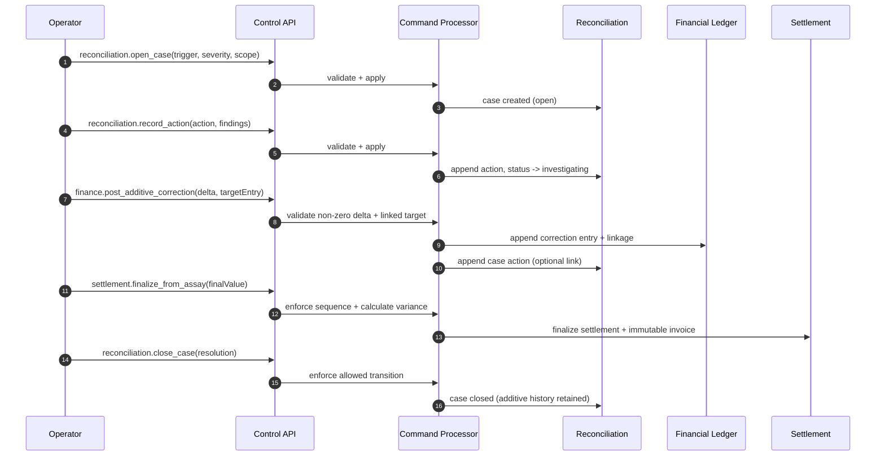

# Architecture Diagrams

These diagrams are public-safe abstractions of the deterministic control platform.
They are intended to clarify control flow, not to expose proprietary implementation details.
Mermaid source files are versioned under `docs/diagrams/*.mmd`.

## 1) Control Plane Topology

## 2) Field-to-Settlement Control Flow

## 3) Divergence and Reconciliation Loop

